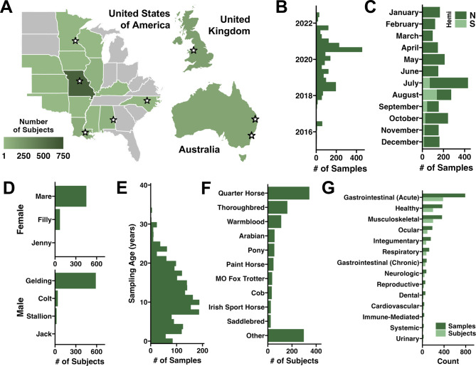

## Group Project - ANSI 5553

**Paper Summary**

The gut microbiome plays a crucial role in understanding and managing equine health. To date, there is very limited research and data regarding "normal" parameters for the microbiome population, how it changes during times of disease, and potential population indicators of active disease or predisposition. Current data is primarily sourced from small sample sizes with a limited geographic scope.

This study aimed to collect an extensive database, sourcing sample collections from eight teaching hospitals located in three different countries across the globe. A total of 2,362 fecal samples were collected from 1,190 equines along with associated demographic and clinical data from individual animals.

This data was analyzed to determine normal parameters of the healthy equine gut microbiome. Demographic and clinical data were cross-referenced to assess factors influencing variation from normal parameters. This data was also used to identify markers of acute gastrointestinal disease, also known as colic.

The goal of this study was to establish a diversified database that will allow researchers, veterinarians, and owners alike to address gaps in knowledge and assist in future research of related topics and fields.

**The Data**

The supplementary data provided by this study were already thoroughly cleaned. Days of age were converted to years by dividing by 365. Data collected from Australia was transformed based on the associated month of collection to match the seasons of data collected from the United States and the United Kingdom. To further clean the data ourselves, samples categorized as "unknown" in the "Sex" category were excluded to allow for the comparison of rates of disease category between male and female subjects.

The tables and figures presented in the original manuscript were generally helpful in explaining the data and associated results. The way that some of the figures were presented was a bit busy to understand, as they were clustered together within the paper. The colors were somewhat difficult to distinguish, as most of the figures were very monochromatic. The data presented in the figures was relatively easy to interpret and was well-represented by the figures. Included below is an image of Figure 1 included in the original manuscript.

{fig-align="center"}

```{r}

```

```{r}
library(tidyverse)   
library(ggprism)
library(lme4)        
library(forcats)


theme_set(theme_prism())

Fecaldata <- read.csv('/Users/haileyobradovich/Desktop/group-project/fecaldata.csv')

Fecaldata %>%
  filter(!is.na(sex), sex %in% c("Male", "Female")) %>%
  mutate(disease_category = forcats::fct_infreq(disease_category)) %>%
  ggplot(aes(x = disease_category, fill = sex)) +
  geom_bar(position = position_dodge(width = 0.8), width = 0.7) +
  coord_flip() +
  scale_fill_manual(values = c("Male" = "blue", "Female" = "hotpink")) +
  scale_y_continuous(
    breaks = seq(0, 550, by = 50),      
  ) +
  labs(
    title = "Sex Distribution by Disease Category",
    x = "Disease Category",
    y = "Number of Cases",
    fill = "Sex"
  ) +
  theme_prism(base_size = 16) +
  theme(
    panel.grid.minor.y = element_line(color = "grey85") 
  )

```

**Figure 1**

Figure 1 below illustrates the distribution of disease categories by sex. To create this figure, data categorized as "unknown" for the variable "Sex" were excluded. This distribution combines figures 1D and 1G from the original manuscript to provide readers with a more comprehensive visual of the data points. Additionally, the figure is color-coded. Male data is represented by blue bars, and female data is represented by pink bars to provide an intuitive distinction between male and female data points.

```{r}
library(tidyverse)
library(ggprism)

Fecaldata <- read.csv('/Users/haileyobradovich/Desktop/group-project/fecaldata.csv')

Fecaldata %>%
  filter(!is.na(sex), !is.na(disease_category), sex %in% c("Male", "Female")) %>%
  mutate(disease_category = forcats::fct_infreq(disease_category)) %>%
  count(sex, disease_category) %>%
  mutate(n = ifelse(sex == "Male", -n, n)) %>%  # flip males to left
  ggplot(aes(x = disease_category, y = n, fill = sex)) +
  geom_bar(stat = "identity") +
  coord_flip() +
  scale_y_continuous(
    labels = abs,
    breaks = seq(-500, 500, by = 50)
  ) +
  scale_fill_manual(values = c("Male" = "blue", "Female" = "hotpink")) +
  labs(
    title = "Sex Distribution by Disease Category",
    x = "Disease Category",
    y = "Number of Cases",
    fill = "Sex"
  ) +
  theme_prism(base_size = 16)
```

**Figure 2**

Our Figure 2 is a recreation of Figure 1C from the original manuscript. We excluded the distinction between the Northern and Southern hemispheres. We rotated the axis to represent a linear timeline of months rather than horizontal. We also altered the color scheme to correlate with the seasonality of the months. These alterations create a figure that reads more naturally and better emphasizes the distribution of samples collected throughout the year.

```{r}
Fecaldata %>%
  filter(!is.na(collection_date)) %>%
  mutate(
    collection_date = as.Date(collection_date, format = "%m/%d/%y"),
    month = month(collection_date, label = TRUE, abbr = FALSE)
  ) %>%
  filter(!is.na(month)) %>%
  count(month) %>%
  mutate(month = factor(month, levels = month.name)) %>%
  ggplot(aes(x = month, y = n, fill = as.character(month))) +
  geom_bar(stat = "identity", width = 0.7) +
  scale_y_continuous(limits = c(0, 500), expand = expansion(mult = c(0, 0.1))) + 
  scale_fill_manual(
    values = c(
      "January" = "#A5C9E1", "February" = "#A5C9E1", "December" = "#A5C9E1",
      "March" = "#88C070", "April" = "#88C070", "May" = "#88C070",
      "June" = "#F9D423", "July" = "#F9D423", "August" = "#F9D423",
      "September" = "#D95F02", "October" = "#D95F02", "November" = "#D95F02"
    ), 
    guide = "none"
  ) +
  annotate("text", x = 1.5, y = 480, label = "Winter", color = "#A5C9E1", size = 6, fontface = "bold") +
  annotate("text", x = 4,   y = 480, label = "Spring", color = "#88C070", size = 6, fontface = "bold") +
  annotate("text", x = 7,   y = 480, label = "Summer", color = "#F9D423", size = 6, fontface = "bold") +
  annotate("text", x = 10,  y = 480, label = "Fall",   color = "#D95F02", size = 6, fontface = "bold") +
  labs(
    title = "Number of Samples by Month of Collection",
    x = "Month",
    y = "Number of Samples"
  ) +
  theme_prism(base_size = 16) +
  theme(
    axis.text.x = element_text(angle = 45, hjust = 1)
  )
```


```{r}
# Option A: Using base R (No extra libraries needed)
ggplot(subset(Fecaldata, !is.na(age_of_collection)), aes(x = age_of_collection / 365)) +
  geom_histogram(binwidth = 1, fill = "blue", color = "grey") +
  scale_x_continuous(breaks = seq(0, 40, by = 2)) +
  labs(title = "Age Distribution (Missing values removed)", x = "Age (Years)")

# Option B: Using the tidyverse (if you have it loaded)
library(dplyr)
Fecaldata %>%
  filter(!is.na(age_of_collection)) %>%
  ggplot(aes(x = age_of_collection / 365)) +
  geom_histogram(binwidth = 1, fill = "blue", color = "grey") +
  scale_x_continuous(breaks = seq(0, 40, by = 2)) +
  labs(title = "Age Distribution", x = "Age (Years)")
```

